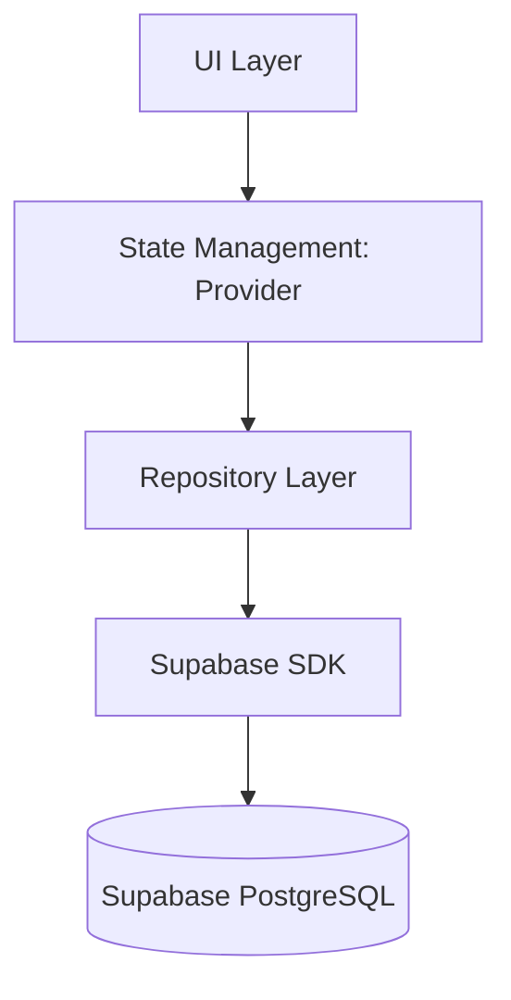

# Architecture: Biblioteca Digital

Este documento define la arquitectura general e infraestructura del backend utilizada en el proyecto `biblioteca_movil`. 

## 1. Patrón de Arquitectura (Frontend + Backend)

La aplicación utiliza Flutter como UI Framework y Supabase como su Backend-as-a-Service (BaaS). Sigue una estructura en capas centrada en una separación de responsabilidades clara:

### 1.1 Modelos de Datos (`lib/models/`)
Poseen la funcionalidad de convertir mapas JSON directamente en Clases Dart y viceversa.
- `CategoryModel`: Maneja la tabla `categories`.
- `BookModel`: Maneja los libros base de la plataforma, tiene una pequeña relación con `CategoryModel`.
- `UserBookModel`: Representa las copias e interacciones personales del usuario con un libro (su estado, rating).

### 1.2 Capa de Repositorios (`lib/repositories/`)
Intermedio con la API de Supabase, maneja el CRUD puro.
- `AuthRepository`: Se encarga de operaciones como `signIn`, `signUp`, y `signOut`.
- `DatabaseRepository`: Ejecuta las queries, filtros, updates y deletes en Supabase Postgres y las mapea al Modelo respectivo.

### 1.3 Capa de Proveedores o "State" (`lib/providers/`)
Mantiene el estado local de la aplicación en memoria.
- `AuthProvider`: Encapsula la reactividad sobre la sesión del usuario para redibujar la UI.
- `BookProvider`: Mantiene el caché de los libros del usuario en una variable estática global expuesta bajo `ChangeNotifier`.

---

## 2. Base de Datos (Supabase PostgreSQL)

Implementamos un diseño altamente normalizado y asegurado mediante RLS (Row Level Security).

### 2.1 Esquema SQL (ER Diagram)

- **authors**
  - `id` (UUID) [PK]
  - `name` (TEXT)

- **categories**
  - `id` (UUID) [PK]
  - `name` (TEXT)

- **books**
  - `id` (UUID) [PK]
  - `title` (TEXT)
  - `description` (TEXT)
  - `cover_url` (TEXT)

- **book_authors** (Pivote M:N)
  - `book_id` (UUID) [FK -> books]
  - `author_id` (UUID) [FK -> authors]

- **book_categories** (Pivote M:N)
  - `book_id` (UUID) [FK -> books]
  - `category_id` (UUID) [FK -> categories]

- **user_books** (Tabla Pivote Extensible)
  - `id` (UUID) [PK]
  - `user_id` (UUID) [FK -> auth.users]
  - `book_id` (UUID) [FK -> books]
  - `status` (TEXT) ['read', 'reading', 'pending']
  - `rating` (INTEGER) [1 - 5]
  - `added_at` (TIMESTAMP)

### 2.2 Seguridad (Row Level Security - RLS)
- Cualquier modificación a `user_books` requiere autorización estricta. El usuario solo podrá ejecutar `INSERT`, `UPDATE` o `DELETE` si la variable `auth.uid()` equivale a la columna `user_books.user_id`.
- Los libros públicos y las categorías se mantienen en "Lectura Pública", mientras se permiten inserciones de nuevos libros solo a usuarios con sesión activa (`authenticated`).

---

## 3. Evolución Arquitectónica (Normalización N:M)

Para garantizar la pureza de los datos y adaptarnos a la Tercera Forma Normal (3NF), la arquitectura original de la BD evolucionó de simples relaciones escalares a estructuras avanzadas **Muchos a Muchos (N:M)** en la versión actual:

### 3.1 Relaciones en Backend (Supabase Postgrest)
En lugar de forzar un solo autor/sección en la tabla `books`, utilizamos tablas pivote con ON DELETE CASCADE (`book_authors` y `book_categories`). Postgrest, el motor detrás de Supabase, cruza eficientemente estas llaves Foráneas; permitiendo cargar todas las subramas en un solo request mediante la sintaxis:
`select('*, authors(*), categories(*)')`.

### 3.2 Implicaciones en Frontend (Modelaje en Dart)
Gracias al empaquetamiento automático de arreglos JSON de Supabase, en Flutter se eliminan los cuellos de botella por N+1 Queries. 
El `BookModel` en su constructor `.fromJson()` atrapa directamente Listas fuertemente tipificadas (`List<AuthorModel>` y `List<CategoryModel>`). Toda la lectura visual desde listados UI toma los autores y géneros desde la memoria caché provista por Provider, manteniendo el Frontend siempre rápido y reactivo sin consultas duplicadas a la DB.